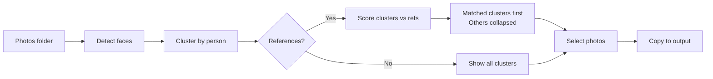

# Face Cluster

A local web app that scans a folder of photos, groups them by person using face recognition, and lets you pick which ones to keep.

Built for teachers who get a big batch of event photos and need to quickly find all photos of specific kids.

## How it works

1. Point it at a folder of photos
2. Optionally add a "References" folder with photos of specific people you care about
3. It detects faces and clusters them by person
4. If references are provided, matching clusters are shown first — the rest are collapsed under "Other people"
5. Browse person-by-person, select the photos you want
6. Copy selected photos to an output folder

Group shots are deduplicated — each photo appears under the single best-matching person.

## Quick start

```bash
pip install -r requirements.txt
uvicorn app:app
```

Open http://localhost:8000

## Features

- **Face clustering** — groups photos by person automatically using ArcFace embeddings
- **Scan caching** — saves results so you don't rescan the same folder twice
- **Reference filtering** — optionally provide reference photos to only show clusters matching specific people
- **Folder browser** — navigate your filesystem from the UI, no need to type paths
- **Subdirectory support** — recursively scans all subfolders
- **Non-destructive** — copies files to output, never modifies originals

## Requirements

- Python 3.10+
- ~1.5 GB disk space for the face recognition model (downloaded automatically on first run)

## Flow



## How clustering works

Uses [InsightFace](https://github.com/deepinsight/insightface) with the `buffalo_l` model (ArcFace) for face detection and embedding extraction. Faces are grouped using greedy cosine-similarity clustering with a 0.4 threshold. The centroid of each cluster is updated as a running average as new faces are added.

## License

MIT
