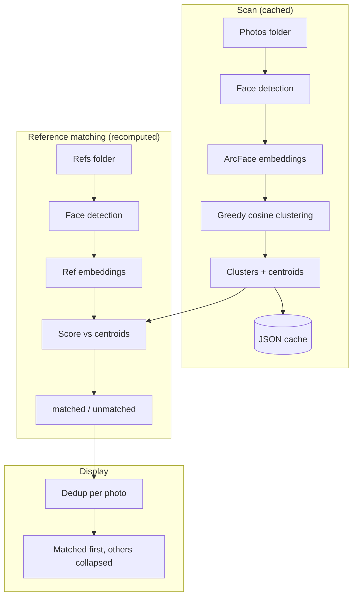

# Face Cluster

A local web app that scans a folder of photos, groups them by person using face recognition, and lets you pick which ones to keep.

Built for parents who get hundreds of photos dumped into a school/kindergarten WhatsApp group and need to find their kid.

## How it works

1. Point it at a folder of photos
2. Optionally add a "References" folder with photos of specific people you care about
3. It detects faces and clusters them by person
4. If references are provided, matching clusters are shown first — the rest are collapsed under "Other people"
5. Browse person-by-person, select the photos you want
6. Copy selected photos to an output folder

Group shots are deduplicated — each photo appears under the single best-matching person.

## Quick start

```bash
pip install -r requirements.txt
uvicorn app:app
```

Open http://localhost:8000

## Features

- **Face clustering** — groups photos by person automatically using ArcFace embeddings
- **Scan caching** — saves results so you don't rescan the same folder twice
- **Reference filtering** — optionally provide reference photos to only show clusters matching specific people
- **Folder browser** — navigate your filesystem from the UI, no need to type paths
- **Subdirectory support** — recursively scans all subfolders
- **Non-destructive** — copies files to output, never modifies originals

## Requirements

- Python 3.10+
- ~1.5 GB disk space for the face recognition model (downloaded automatically on first run)

## Data pipeline



## How embeddings work

Each detected face is converted into a 512-dimensional vector (embedding) by the ArcFace model — a numeric fingerprint where faces of the same person land close together in that space.

Cosine similarity measures how close two embeddings are: 1.0 = identical, 0.0 = completely unrelated. For example:
- Two photos of the same kid smiling → ~0.75
- Same kid, one photo from the side → ~0.50
- Two completely different people → ~0.15

The app uses embeddings in three ways:

**Clustering** — For each new face, compare its embedding to every existing cluster centroid. If the best match is ≥ 0.4, merge it in and update the centroid (running average). Otherwise, start a new cluster. So if you scan 300 photos with 20 different people, you end up with ~20 clusters, each with a centroid that represents the "average face" of that person.

**Reference matching** — Extract embeddings from your reference photos (e.g. 3 photos of your kid), then score each cluster centroid against them. A cluster with similarity ≥ 0.3 to any reference is marked as matched. This is fast — just dot products against the centroids, no need to rescan the original photos.

**Deduplication** — A group photo with 3 faces ends up in 3 clusters. Each cluster stores its similarity score for that image. The app shows the photo only in the cluster where it scored highest, so you don't see the same group shot repeated 3 times.

## License

MIT
